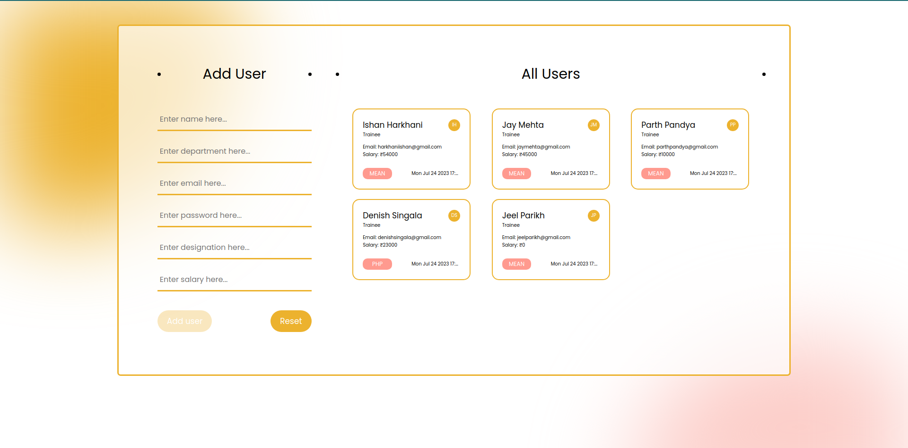
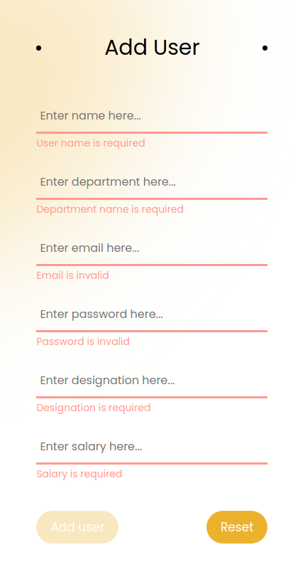
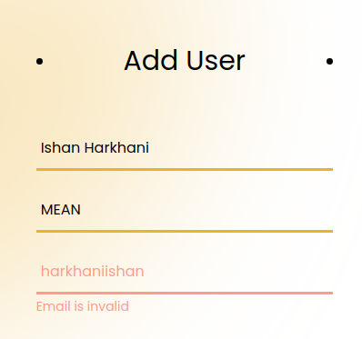
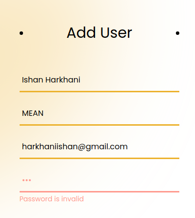
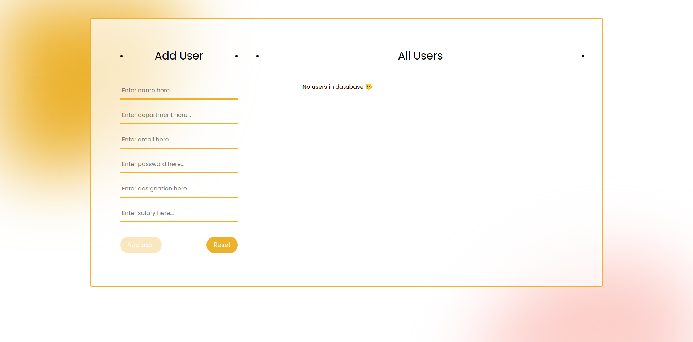

# practical_5

## 📝 Table of Contents

- [AIM](#aim)
- [Usage](#usage)
- [Output](#output)

 

## 🏁 AIM 

List all users on the page with columns consisting:

Name, Email, Department, Salary, Date

Add User will contain the following fields:

Name, Department (Text), Email, Password, Designation, Salary

Email and password should have validation. Password validation should be character between 8 to 16 are allowed with 1 number and 1 special character.

 

> ### ⛏️ Dependencies

- Angular
- HTML
- CSS
- Typescript

 

## 🎈 Usage 
Clone the repo using below command: 
<code>$ git clone (web URL)</code> 

 

Then open the terminal and run the below command: 
<code>$ npm i</code> 

 

Then run below command to run the angular project: 
<code>$ ng serve --o</code> 

 

and then go to "localhost:4200" to see the output.
 

 

## 🎉 Output 

### Possible outputs
 

<ol>
    <li>Home Page</li> 
      
    <li>Error handling:</li>
    <ul>
        <li>All validations</li> 
          
        <li>Email validation</li> 
          
        <li>Password validation</li> 
          
    </ul>
    <li>Added users will be shown in all users section:</li> 
    <ul>
        <li>If users exists</li> 
          
        <li>If users don't exists</li> 
          
    </ul>
</ol>

##  ✍️ Author: ISHAN HARKHANI